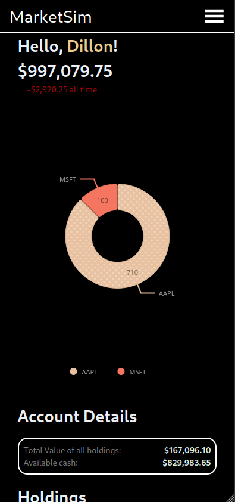
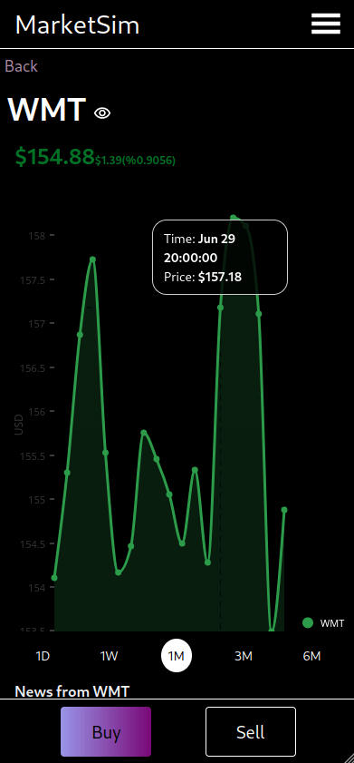

# MarketSim-v2




MarketSim is a stock market simulator created using React, Express, TypeScript, and PostgresQL. MarketSim was designed to be mobile-first, but also desktop friendly. The main goal of this project is to allow users to practice making investments without the risk of the real-world stock market. Feel free to make mistakes and try new things, because it's just a simulation.

## Features

- Fork of [sm_sim](https://github.com/dillonkmcquade/sm_sim) rewritten with a PostgreSQL database

- Search and gather information on up to 21,000 publically traded companies.

- Create an account to track investments, login with google, github, microsoft via [ Auth0 ](https://auth0.com)

- Each user is given $1,000,000 to begin with.

- Data visuals for analyzing past and current performance of stocks ([nivo.rocks](https://nivo.rocks))

- Data visuals for breaking down portfolio composition ([nivo.rocks](https://nivo.rocks))

- Buy, sell stocks

- Track companies via watch list

- Real-time stock quotes from the US market ([Finnhub.io](https://finnhub.io) for quotes and historical data & [Polygon.io](https://polygon.io) for news)

- Edit user information

- Delete account if desired

## Run it locally

Get your own free api keys from [Finnhub.io](https://finnhub.io) and [Polygon.io](https://polygon.io).

### Frontend

Place the following environment variables in a .env in the client folder:

- `REACT_APP_SERVER_URL="http://localhost:3001"`
- `REACT_APP_POLYGON_KEY=<yourApiKey>`
- `REACT_APP_FINNHUB_KEY=<yourApiKey>`
- `REACT_APP_AUTH0_DOMAIN=<yourAuth0Domain>`
- `REACT_APP_AUTH0_CLIENT_ID=<yourAuth0ClientId>`
- `REACT_APP_AUTH0_AUDIENCE=<nameOfYourService>`

```bash
git clone https://github.com/dillonkmcquade/sm_sim-v2.git
cd sm_sim-v2/client
pnpm install #optionally use yarn/npm
pnpm dev
```

### Backend

Place the following environment variables in a .env in the server folder:

- `POLYGON_KEY=<yourApiKey>`
- `FINNHUB_KEY=<yourApiKey>`
- `ALLOWED_ORIGIN="http://localhost:3000"`
- `POSTGRES_PASSWORD=<anyPassword>`
- `POSTGRES_USER="postgres"`
- `POSTGRES_DB="marketsim"`
- `POSTGRES_HOST="server-postgres-1"`
- `AUTH0_DOMAIN=<yourAuth0Domain>`
- `AUTH0_AUDIENCE=<nameOfYourService>`

To start:

```bash
cd server

#with docker
docker compose up
```

## License

This project is licensed under an MIT license.
